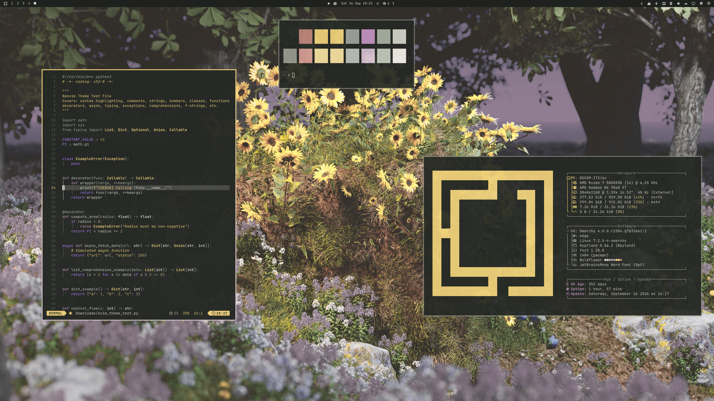
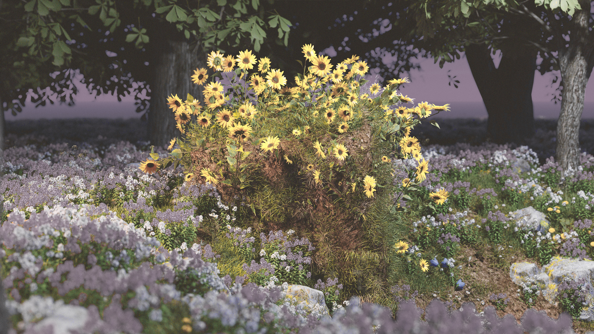
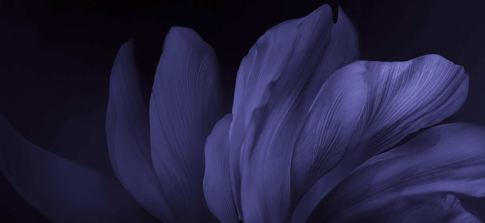
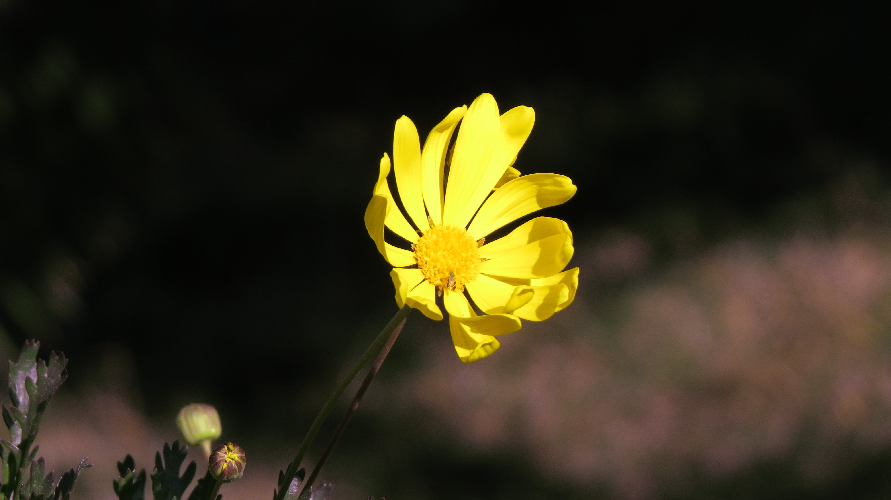
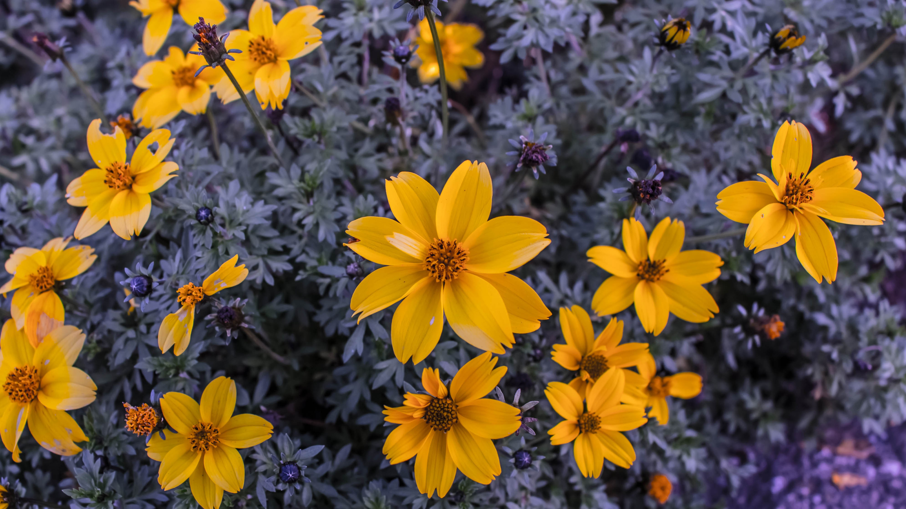

# Wildflower

*Pollen gold in the shade. Dusk lilac at the edges.*

Wildflower is a dark Omarchy theme drawn from golden flowers beneath a shaded canopy. Near-neutral stone and leaf shadows keep the desktop quiet; pollen gold marks focus; dusk lilac brings a softer second voice.



## Wallpaper gallery

The original Wildflower image remains the main reference. The four wallpapers use their native source resolutions; none has been fake-upscaled or colour-filtered.

<table>
  <tr>
    <td align="center">
      <a href="backgrounds/01-wildflower.jpg"></a><br>
      <strong>01 · Wildflower</strong><br>
      <sub>5760 × 3240 · <a href="https://wallhaven.cc/w/6dm2r6">Wallhaven 6dm2r6</a></sub>
    </td>
    <td align="center">
      <a href="backgrounds/04-purple-closeup.jpg"></a><br>
      <strong>04 · Purple Close-up</strong><br>
      <sub>4680 × 2160 · <a href="https://wallhaven.cc/w/21kz5g">Wallhaven 21kz5g</a></sub>
    </td>
  </tr>
  <tr>
    <td align="center">
      <a href="backgrounds/05-gold-flower-dark.jpg"></a><br>
      <strong>05 · Gold Flower Dark</strong><br>
      <sub>4000 × 2248 · <a href="https://wallhaven.cc/w/4yl2xg">Wallhaven 4yl2xg</a></sub>
    </td>
    <td align="center">
      <a href="backgrounds/06-gold-violet-blooms.jpg"></a><br>
      <strong>06 · Gold-Violet Blooms</strong><br>
      <sub>3980 × 2239 · <a href="https://wallhaven.cc/w/43167v">Wallhaven 43167v</a></sub>
    </td>
  </tr>
</table>

## Palette

| Role | Material | Colour |
|---|---|---|
| Background | Shadowed canopy | `#252824` |
| Surface | Stump shade | `#343831` |
| Text | Stone petals | `#D3D3CA` |
| Primary accent | Pollen gold | `#EED079` |
| Support accent | Dusk lilac | `#C393C1` |
| Selection | Canopy moss | `#484836` |

[`colors.toml`](colors.toml) supplies Omarchy's runtime palette. [`wildflower-base24.yaml`](wildflower-base24.yaml) maps it into 24 named slots for Base24-compatible tools; Omarchy does not read that file directly. The ANSI map is deliberately nonliteral: green and yellow both carry pollen gold, cyan carries sage stone, blue quiet canopy stone, and magenta dusk lilac. Where supported, an explicit success role keeps leaf sage. The design rationale is in [`DESIGN.md`](DESIGN.md).

## Included styling

- Omarchy shell surfaces and selection styling from `shell.toml`
- GTK, Cava, Zed, and Zen Browser theme files
- Vencord styling based on [Midnight by Refact0r](https://github.com/refact0r/midnight-discord), recoloured with Wildflower's palette
- A Yaru-Purple icon-theme selection in `icons.theme` (the icon pack is not bundled)
- Four high-resolution wallpapers, with sources in [`backgrounds/SOURCES.md`](backgrounds/SOURCES.md)

The menu's selected row keeps its solid canopy-moss fill and uses a gold-to-lilac left stripe. No custom Omarchy plugin is required. The reference desktop's Hyprland window-frame width is a local setting, not part of the portable theme.

Vencord's Midnight stylesheet is imported from Refact0r's site, so Vencord/Vesktop and network access are required for that styling. App-specific files need the corresponding application and theme support.

## Install

Place this directory at `~/.config/omarchy/themes/wildflower`, then activate it with:

```bash
omarchy theme set wildflower
```

For a local development checkout outside the Omarchy theme directory, run from the repository root. The destination must not already exist:

```bash
mkdir -p ~/.config/omarchy/themes
ln -s "$(pwd)" ~/.config/omarchy/themes/wildflower
omarchy theme set wildflower
```

## Credits and rights

Wallpaper origins are linked in [`backgrounds/SOURCES.md`](backgrounds/SOURCES.md). Each image remains under its creator's terms; confirm reuse permission before redistributing the image files. The preview screenshot also contains the original wallpaper and follows the same restriction. The theme repository currently has no project license file, so no license for its code should be assumed.
